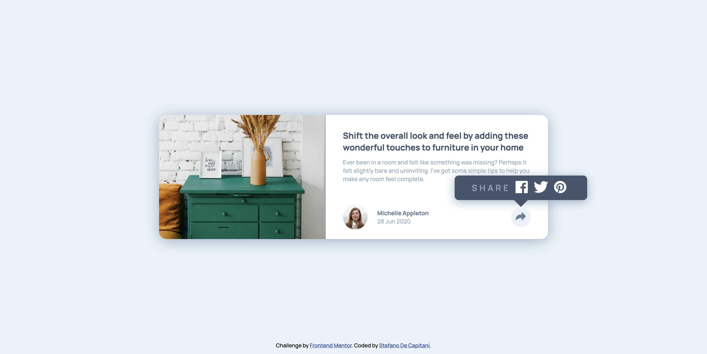

# Frontend Mentor - Article preview component solution

This is a solution to the [Article preview component challenge on Frontend Mentor](https://www.frontendmentor.io/challenges/article-preview-component-dYBN_pYFT). Frontend Mentor challenges help you improve your coding skills by building realistic projects.

## Table of contents

- [Overview](#overview)
  - [The challenge](#the-challenge)
  - [Screenshot](#screenshot)
  - [Links](#links)
- [My process](#my-process)
  - [Built with](#built-with)
  - [What I learned](#what-i-learned)
  - [Continued development](#continued-development)
  - [Useful resources](#useful-resources)
- [Author](#author)

## Overview

### The challenge

Users should be able to:

- View the optimal layout for the component depending on their device's screen size
- See the social media share links when they click the share icon

### Screenshot

### Links

- Solution URL: [https://github.com/StefanoDeCapitani/article-preview](https://github.com/StefanoDeCapitani/article-preview)
- Live Site URL: [https://stefanodecapitani.github.io/article-preview/](https://stefanodecapitani.github.io/article-preview/)

## My process

### Built with

- Semantic HTML5 markup
- CSS custom properties
- Flexbox
- CSS Grid
- Mobile-first workflow

### What I learned

I think I've got much better at making things responsive! There's a lot more that I can learn, but for the first time I've been able to make the page seamlessly streck and shrink without any issues.

### Continued development

This time I got into cross browser compatibility problems and I understood that I'll have to learn more about that.

### Useful resources

- [min(), max() and clamp() are CSS magic!](https://www.youtube.com/watch?v=U9VF-4euyRo) - This tutorial by Kevin Powell introduced me to the magic of clamp(). Using this property I could make font-sizes responsive with only one line of code! That's really cool, thanks Kevin.

## Author

- Frontend Mentor - [@StefanoDeCapitani](https://www.frontendmentor.io/profile/StefanoDeCapitani)
